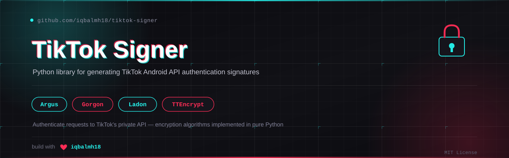

<p align="center">
  
</p>

# TikTok Signer

Python library for generating TikTok Android API authentication signatures. Implements the required encryption algorithms (Argus, Gorgon, Ladon, TTEncrypt) used by TikTok's Android client.

## Features

- Generate complete authentication headers: `x-ladon`, `x-gorgon`, `x-khronos`, `x-argus`, `x-ss-req-ticket`, `x-tt-trace-id`, `x-ss-stub`
- Stable device fingerprint via `DeviceProfile` (device id, openudid, cdid, device model, OS version, channel)
- TTEncrypt payload encryption/decryption (gzip-compressed like the real app)
- Protobuf encode/decode
- Clear return contract via `SignedHeader` constants
- Zero network dependencies — signatures only

## Installation

```bash
pip install tiktok-signer
```

From source:

```bash
git clone https://github.com/iqbalmh18/tiktok-signer.git
cd tiktok-signer
pip install .
```

Development install:

```bash
pip install -e ".[dev]"
```

## Requirements

- Python 3.10 or higher
- pycryptodome 3.20.0 or higher

## Quick Start

```python
from tiktok_signer import TikTokSigner

# Generate authentication headers
headers = TikTokSigner.generate_headers(params="aid=1233&app_name=musical_ly")

# Encrypt device registration payload
encrypted = TikTokSigner.encrypt({"device_id": "123456", "os": "android"})

# Decrypt response
decrypted = TikTokSigner.decrypt(encrypted_bytes)

# Encode dict to protobuf format
protobuf_data = TikTokSigner.encode({1: "value", 2: 123})

# Decode protobuf response
dict_data = TikTokSigner.decode(protobuf_bytes)
```

## Stable Device Fingerprint

TikTok tracks requests by the device they originate from. The signer generates
a `DeviceProfile` (device id, device model, OS version, channel) and reuses it
for every signed request, so the fingerprint stays consistent within a session.
Call `set_device()` once at startup:

```python
from tiktok_signer import DeviceProfile, TikTokSigner

TikTokSigner.set_device(DeviceProfile(device_id="1234567890abcdef"))
# ...every subsequent generate_headers() call uses this device
```

To persist a profile across restarts, save
`TikTokSigner.get_device().to_json()` and restore it with
`TikTokSigner.set_device(saved_json)`.

## API Reference

### TikTokSigner.generate_headers()

Generates all authentication headers required for a TikTok API request.

```python
headers = TikTokSigner.generate_headers(
    params,                                      # Required: URL query parameters (str or dict)
    data=None,                                   # Optional: Request body for POST (str, bytes, or dict)
    device_id=None,                              # Optional: Device identifier (use DeviceProfile instead)
    aid=1233,                                    # Optional: Application ID (int or str)
    lc_id=2142840551,                            # Optional: License ID (int or str)
    sdk_ver="v05.01.02-alpha.7-ov-android",      # Optional: SDK version name
    sdk_ver_code=83952160,                       # Optional: SDK version code (int or str)
    version_name="37.0.4",                       # Optional: App version name
    version_code=2023700040,                     # Optional: App version code (int or str)
    cookie=None,                                 # Optional: Cookie string
    unix=None,                                   # Optional: Unix timestamp in seconds
    device=None                                  # Optional: DeviceProfile for this call
)
```

**Returns:** A `dict[str, str]` of authentication headers. Header names are
available as constants on `SignedHeader`:

| Constant | Header | Always present | Meaning |
| --- | --- | --- | --- |
| `SignedHeader.REQ_TICKET` | `x-ss-req-ticket` | yes | Request timestamp in milliseconds |
| `SignedHeader.TRACE_ID` | `x-tt-trace-id` | yes | Trace identifier |
| `SignedHeader.STUB` | `x-ss-stub` | only when `data` given | MD5 of the request body |
| `SignedHeader.LADON` | `x-ladon` | yes | Ladon authentication token |
| `SignedHeader.GORGON` | `x-gorgon` | yes | Gorgon request signature |
| `SignedHeader.KHRONOS` | `x-khronos` | yes | Unix timestamp |
| `SignedHeader.ARGUS` | `x-argus` | yes | Argus authentication token |
| `SignedHeader.COOKIE` | `cookie` | only when `cookie` given | Cookie string |

### TikTokSigner.set_device() / get_device()

Manage the active device profile used for all subsequent signed requests.

```python
TikTokSigner.set_device(device)  # device: DeviceProfile | dict | JSON str | None
profile = TikTokSigner.get_device()  # -> DeviceProfile
```

Passing `None` generates a fresh random profile. A `dict` or JSON string is
loaded with `DeviceProfile.load()`.

### DeviceProfile

Stable per-device identity used to keep the TikTok fingerprint consistent.

```python
profile = DeviceProfile(
    device_id="1234567890abcdef",  # Optional: defaults to a random 16-hex id
    device_type="2203121C",        # Optional: device model
    os_version="9",                # Optional: OS version
    channel="googleplay",          # Optional: distribution channel
)
profile.to_dict()   # -> dict
profile.to_json()   # -> JSON str (for persistence)
DeviceProfile.load(data)  # data: dict or JSON str
```

### TikTokSigner.encrypt()

Encrypts data using the TTEncrypt algorithm for device registration.

```python
encrypted = TikTokSigner.encrypt(data)  # data: str, bytes, or dict
```

**Returns:** Encrypted bytes

### TikTokSigner.decrypt()

Decrypts data encrypted with TTEncrypt.

```python
decrypted = TikTokSigner.decrypt(encrypted_bytes)
```

**Returns:** Decrypted string (typically JSON)

### TikTokSigner.encode()

Encodes a dictionary to protobuf format.

```python
protobuf_data = TikTokSigner.encode(data)  # data: dict with int keys
```

**Returns:** Protobuf encoded bytes

### TikTokSigner.decode()

Decodes protobuf data to a dictionary.

```python
dict_data = TikTokSigner.decode(protobuf_bytes)
```

**Returns:** Dictionary with field numbers as keys

## Usage Examples

### GET Request

```python
import asyncio
from urllib.parse import urlencode
from curl_cffi import AsyncSession, Response
from tiktok_signer import DeviceProfile, TikTokSigner

async def fetch_feed():
    TikTokSigner.set_device(DeviceProfile(device_id="1234567890abcdef"))

    params = {
        "aid": 1233,
        "app_name": "musical_ly",
        "device_platform": "android",
        "os_version": "9",
        "device_type": "2203121C",
        "device_brand": "Xiaomi",
        "language": "id",
        "region": "ID",
    }
    query_string = urlencode(params)
    auth_headers = TikTokSigner.generate_headers(params=query_string)

    headers = {
        "User-Agent": "com.zhiliaoapp.musically/2023700040 (Linux; U; Android 9; in_ID; 2203121C; Build/PQ3A.190705.09121607;tt-ok/3.12.13.4-tiktok)",
        "Accept-Encoding": "gzip",
    }
    headers.update(auth_headers)

    url = f"https://api.tiktokv.com/aweme/v1/feed/?{query_string}"
    async with AsyncSession(http_version="v2tls", response_class=Response) as session:
        resp = await session.get(url, headers=headers)
        return resp.json()

asyncio.run(fetch_feed())
```

### POST Request with Body

```python
import asyncio
from urllib.parse import urlencode
from curl_cffi import AsyncSession, Response
from tiktok_signer import TikTokSigner

async def post_login():
    params = "aid=1233&app_name=musical_ly"
    data = urlencode({
        "username": "example",
        "password": "encrypted_password",
        "mix_mode": 1,
    }).encode()

    auth_headers = TikTokSigner.generate_headers(
        params=params,
        data=data,
        cookie="sessionid=abc123; tt_csrf_token=xyz789",
    )

    headers = {
        "User-Agent": "com.zhiliaoapp.musically/2023700040 (Linux; U; Android 9; in_ID; 2203121C)",
        "Content-Type": "application/x-www-form-urlencoded",
    }
    headers.update(auth_headers)

    url = f"https://api.tiktokv.com/passport/user/login/?{params}"
    async with AsyncSession(http_version="v2tls", response_class=Response) as session:
        resp = await session.post(url, headers=headers, data=data)
        return resp.json()

asyncio.run(post_login())
```

## Registering a Device

This library only generates signatures. Registering a device (getting
`device_id` / `install_id`) is done by sending the signed request yourself —
for example with `curl_cffi` — using `TikTokSigner.encrypt()` for the payload
and `TikTokSigner.generate_headers()` for the auth headers.

```python
import asyncio
from time import time
from urllib.parse import urlencode
from curl_cffi import AsyncSession, Response
from tiktok_signer import DeviceProfile, TikTokSigner

def build_register_params(profile: DeviceProfile) -> dict:
    return {
        "aid": "1233", "app_id": "1233", "os": "0", "device_platform": "android",
        "region": "ID", "current_region": "ID", "sys_region": "ID", "op_region": "ID",
        "residence": "ID", "app_language": "id", "language": "id", "locale": "id-ID",
        "channel": profile.channel, "device_type": profile.device_type,
        "device_brand": "Xiaomi", "version_code": "2023700040",
        "version_name": "37.0.4", "build_number": "37.0.4", "ab_version": "37.0.4",
        "manifest_version_code": "2023700040", "update_version_code": "2023700040",
        "resolution": "720*1280", "dpi": "320", "os_api": "28",
        "os_version": profile.os_version, "ac": "wifi", "ac2": "wifi", "is_pad": "0",
        "app_type": "normal", "mcc_mnc": "51000", "timezone_name": "Asia/Bangkok",
        "timezone_offset": "25200", "carrier_region": "ID", "carrier_region_v2": "510",
        "host_abi": "arm64-v8a", "openudid": profile.openudid, "cdid": profile.cdid,
    }

async def register_device():
    profile = DeviceProfile()
    TikTokSigner.set_device(profile)

    params_str = urlencode(build_register_params(profile))
    device_info = {
        "magic_tag": "ss_app_log",
        "header": {
            "display_name": "TikTok", "aid": 1233, "channel": profile.channel,
            "package": "com.zhiliaoapp.musically", "version_name": "37.0.4",
            "os": "Android", "os_version": profile.os_version,
            "device_model": profile.device_type, "device_brand": "Xiaomi",
            "openudid": profile.openudid, "clientudid": profile.cdid, "language": "id",
        },
        "_gen_time": int(time() * 1000),
    }
    body = TikTokSigner.encrypt(device_info)

    headers = TikTokSigner.generate_headers(params=params_str, data=body, device=profile)
    headers.update({
        "user-agent": "com.zhiliaoapp.musically/2023700040 (Linux; U; Android 9; in_ID; 2203121C; Build/PQ3A.190705.09121607;tt-ok/3.12.13.4-tiktok)",
        "accept-encoding": "gzip",
        "content-type": "application/octet-stream",
    })

    url = f"https://log.tiktokv.com/service/2/device_register/?{params_str}"
    async with AsyncSession(http_version="v2tls", response_class=Response) as session:
        resp = await session.post(url, headers=headers, data=body)
        data = resp.json()
    print("device_id :", data.get("device_id_str") or data.get("device_id"))
    print("install_id:", data.get("install_id_str") or data.get("install_id"))

asyncio.run(register_device())
```

## Encryption Algorithms

This library implements four main encryption algorithms used by TikTok's
Android API:

- **Argus** — primary signature using Simon cipher and SM3 hash (`x-argus` header)
- **Gorgon** — request integrity signature with timestamp (`x-gorgon`, `x-khronos` headers)
- **Ladon** — license-based authentication token (`x-ladon` header)
- **TTEncrypt** — payload encryption for device registration

## Default Values

Based on TikTok Android app version 37.0.4:

- `aid`: 1233
- `lc_id`: 2142840551
- `sdk_ver`: v05.01.02-alpha.7-ov-android
- `sdk_ver_code`: 83952160
- `version_name`: 37.0.4
- `version_code`: 2023700040

## Project Structure

```
tiktok-signer/
├── pyproject.toml
├── README.md
├── LICENSE
├── MANIFEST.in
└── tiktok_signer/
    ├── __init__.py
    ├── signer.py
    ├── example.py
    └── lib/
        ├── __init__.py
        ├── argus.py
        ├── gorgon.py
        ├── ladon.py
        ├── stub.py
        ├── ttencrypt.py
        ├── data/
        │   └── dword.json
        └── utils/
            ├── __init__.py
            ├── protobuf.py
            ├── simon.py
            └── sm3.py
```

## Contributing

1. Fork the repository.
2. Create a feature branch.
3. Install the development dependencies: `pip install -e ".[dev]"`
4. Run the checks: `ruff check tiktok_signer tests` and `pytest`
5. Open a pull request.

## License

MIT License. See [LICENSE](LICENSE) for details.

## Changelog

### v1.4.0
- Single public API: all operations via `TikTokSigner`; module-level shortcuts removed
- Added `SignedHeader` constants as the clear return contract for `generate_headers()`
- Added `DeviceProfile` and `set_device()`/`get_device()` for a stable device fingerprint
- Fixed TTEncrypt payload: `encrypt()` now gzip-compresses input like the Android app,
  so device_register no longer returns `device_id: 0` and local decrypt round-trips
- Fixed varint boundary bug in `ProtoWriter.write_varint` (128 was encoded as `00`)
- Fixed shared mutable cipher state in `TTEncrypt` (now per-instance)
- Removed dead code and duplicate `lib/utils/stub.py`

### v1.3.0
- Changed `app_ver` to `version_name` in generate headers parameters
- Updated version to 1.3.0

### v1.2.1
- Published to PyPI
- Added GitHub workflow for automatic PyPI publishing

### v1.2.0
- Added protobuf encode/decode support
- Exposed `ProtoBuf` class
- Added shortcut functions for encode/decode

### v1.1.0
- Consolidated signer into a single module
- Added `unix` parameter for custom timestamp support
- Added `version_name` and `version_code` parameters
- Separated SDK version from App version
- Added default values from TikTok App

### v1.0.0
- Initial release
- Implemented Argus, Gorgon, Ladon encryption
- Implemented TTEncrypt for device registration

## Disclaimer

This library is for educational and research purposes only. Use must comply
with TikTok's Terms of Service and applicable laws. The author is not
responsible for any misuse.
